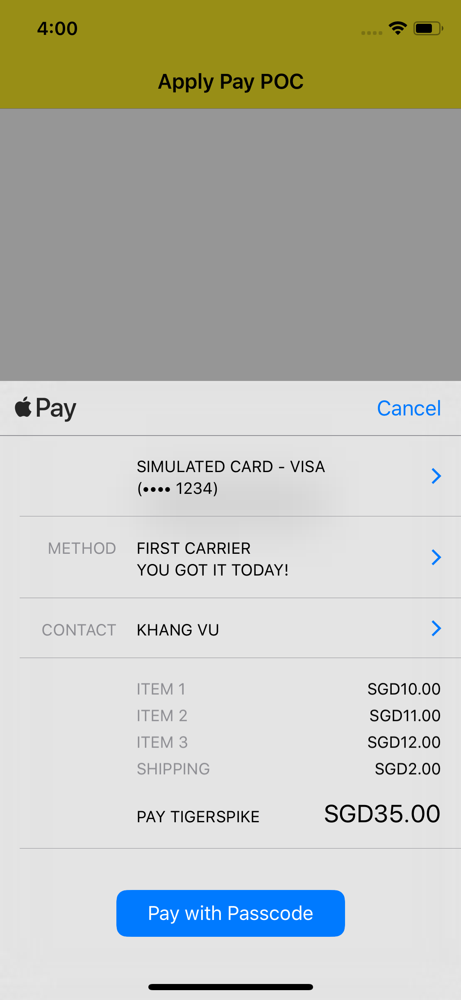

# Apple Pay Proof of Concept (POC) documentation

* MerchantID used: ` "merchant.com.adyen.flyscoot.test" `

## Process workflow
This POC has successfully created a fully functional app capable of making payments using Apple Pay (using aforementioned MerchantID to process the payment as testing environment). It contains of an ApplePay button, which can be clicked to trigger the ApplePay payment sheet.

Essentially, ApplePay doesn't fulfill payment transactions, but only authorizes transactions and creates token that allow payments to be processed by a *payment processor* (such as Navitair in this case).

Once we get the an authorization token from ApplePay, we can send it to Navitair for processing. With the following 3 steps:

1. Send the authorization token object to Navitair for decryption. If successful, Navitair will return their own token.
2. Send that token to our server (our middleware, or backend side) to let us know about the order and perform any necessary processing.
3. Send the token from Navitair back to them to trigger the charge.

Here's what I've been finding so far.

